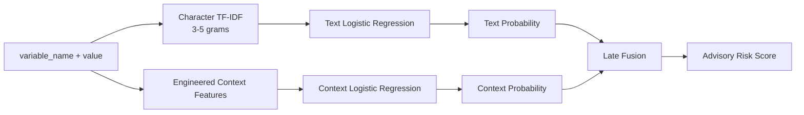
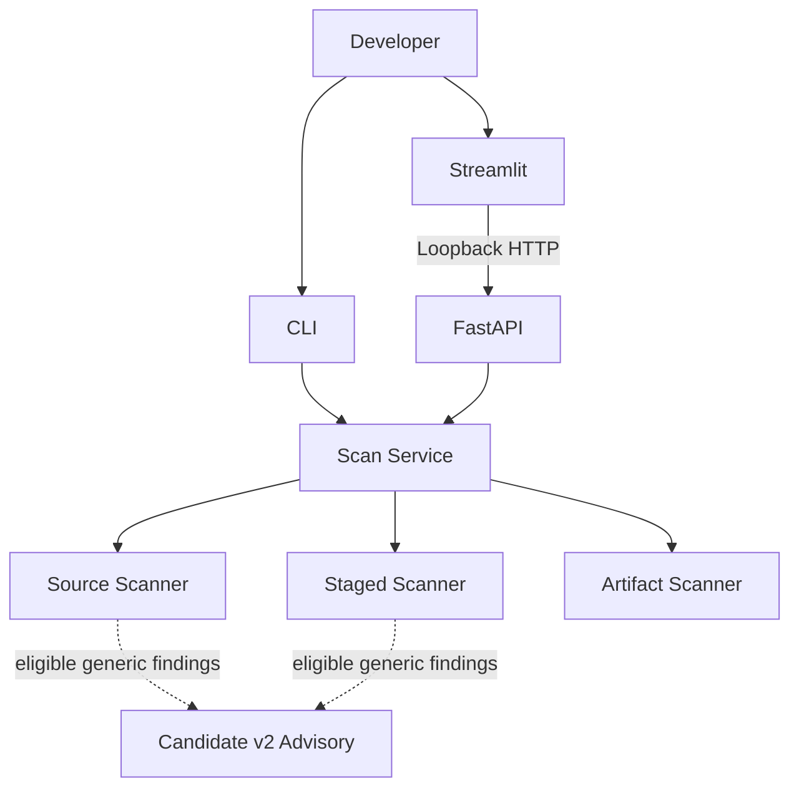

# LeakGuard AI

> **Code fast with AI. Ship without leaking secrets.**

LeakGuard AI is a local-first security gate for detecting accidental secret exposure in source code, staged Git changes, and selected build artifacts.

It combines deterministic detection, contextual heuristics, build-artifact propagation checks, and an optional experimental machine-learning advisory layer while deliberately keeping blocking authority outside the ML model.

---

## Table of Contents

- [Why LeakGuard Exists](#why-leakguard-exists)
- [What LeakGuard Detects](#what-leakguard-detects)
- [Security Philosophy](#security-philosophy)
- [Supported Inputs](#supported-inputs)
- [Installation](#installation)
- [Quick Start](#quick-start)
- [CLI Usage](#cli-usage)
- [Machine-Learning Advisory](#machine-learning-advisory)
- [FastAPI Service](#fastapi-service)
- [Streamlit Dashboard](#streamlit-dashboard)
- [Docker](#docker)
- [Architecture](#architecture)
- [CI and Verification](#ci-and-verification)
- [Current Limitations](#current-limitations)
- [Documentation](#documentation)

---

## Project Status

| Property | Current State |
|---|---|
| Version | `0.1.0` |
| Python | `>=3.11` |
| Primary purpose | Defensive secret-leak prevention |
| Default ML state | Disabled |
| ML authority | Advisory only |
| Standard API bind | `127.0.0.1:8000` |
| Standard UI bind | `127.0.0.1:8501` |
| Container host exposure | Dashboard only |
| CI coverage | Ubuntu, Windows, macOS, package build, Docker |
| Security posture | Deterministic gate + optional ML advisory |

LeakGuard AI is an engineering and security project under active development. It is intended to complement, not replace, mature secret-scanning and repository-security platforms.

---

## Why LeakGuard Exists

AI-assisted coding and "vibe coding" can dramatically accelerate development. The same speed can also make it easier to accidentally ship sensitive material.

Common failure modes include:

- API keys embedded directly in source files
- tokens staged for commit
- secret-like values generated into application code
- public frontend environment variables exposing sensitive values
- dotenv values copied into production build artifacts
- unknown high-entropy credentials that do not match a provider-specific pattern
- incomplete scans that silently skip files

LeakGuard is designed to make those mistakes visible before code is shipped.

### Beginner mental model

Think of LeakGuard as a security checkpoint:

```text
Developer code
     |
     v
LeakGuard
     |
     +--> known secret checks
     +--> client exposure checks
     +--> generic secret heuristics
     +--> build artifact propagation checks
     +--> coverage safety checks
     |
     v
PASS or FAIL
```

The optional ML model does **not** replace this checkpoint. It only adds advisory context to some findings.

---

## What LeakGuard Detects

LeakGuard currently uses several independent security layers.

### 1. Known Secret Patterns

Deterministic rules identify recognized secret formats.

These findings have blocking authority.

### 2. Client-Side Exposure Detection

LeakGuard detects supported cases where sensitive environment values are exposed through frontend-visible configuration patterns.

These findings have blocking authority.

### 3. Generic Secret Candidate Detection

Unknown assignments are evaluated using deterministic signals such as:

- sensitive variable naming
- candidate length
- entropy
- character variety

This layer is **not** machine learning.

### 4. Build Artifact Propagation Detection

LeakGuard checks whether eligible dotenv values have propagated into supported build outputs.

Dedicated artifact roots currently include:

```text
dist/
build/
.next/static/
```

Artifact propagation findings are deterministic.

### 5. Scan Coverage Enforcement

If supported-looking content cannot be scanned safely, LeakGuard does not silently report success.

Examples include:

- supported files larger than the configured safe limit
- strong binary evidence in a supported text format
- unsafe staged filesystem states

LeakGuard emits a `Scan Coverage Limitation` finding instead.

### 6. Candidate v2 ML Advisory

Candidate v2 is optional and experimental.

It can add contextual advisory metadata to eligible generic deterministic findings.

Candidate v2 cannot independently:

- create a blocking finding
- suppress a deterministic finding
- change severity
- make the gate pass
- make the gate fail

Its risk score is **not a calibrated probability**.

---

## Security Philosophy

LeakGuard is built around a small set of security invariants.

### Deterministic findings own blocking authority

The gate result is intentionally simple:

```text
zero findings     -> PASS
one or more       -> FAIL
```

Machine learning does not override this rule.

### Raw secrets are not public output

Raw values may exist transiently in process memory because exact matching and model scoring require them.

Public findings expose masked values.

### Local-first boundaries

The standard API and dashboard bind to loopback.

The dashboard only accepts loopback API endpoints.

### Fail closed when coverage is unsafe

If LeakGuard cannot establish sufficient scan coverage safely, it reports a finding instead of silently skipping the problem.

### Model integrity before deserialization

The trusted Candidate v2 artifact is checked against a frozen SHA-256 identity before it is loaded.

---

## Supported Inputs

### Source files

```text
.py
.js
.jsx
.ts
.tsx
.json
.yaml
.yml
.html
```

### Supported dotenv files

```text
.env
.env.local
.env.development
.env.production
```

### Built-in skipped directories

```text
.git/
.venv/
__pycache__/
node_modules/
```

### Project-specific ignore rules

Create:

```text
.leakguardignore
```

Use it for intentional exclusions.

---

## Supported Build Artifacts

Dedicated build-output scanning currently covers supported files under:

```text
dist/
build/
.next/static/
```

Supported artifact extensions include:

```text
.js
.mjs
.cjs
.css
.html
.json
.map
.txt
```

---

## Installation

### 1. Create a virtual environment

```bash
python -m venv .venv
```

### 2. Activate it

Windows PowerShell:

```powershell
.\.venv\Scripts\Activate.ps1
```

Linux/macOS:

```bash
source .venv/bin/activate
```

### 3. Install LeakGuard

For development:

```bash
python -m pip install -e ".[dev]"
```

### 4. Verify the CLI

```bash
leakguard version
```

---

## Quick Start

### Scan a project

```bash
leakguard scan .
```

### Scan without ML advisory

```bash
leakguard scan . --no-ml-advisory
```

### Scan staged Git content

```bash
leakguard scan . --staged --no-ml-advisory
```

### Enable Candidate v2 advisory scoring

```bash
leakguard scan . --ml-advisory
```

---

## CLI Usage

LeakGuard installs four console entrypoints:

```text
leakguard
leakguard-api
leakguard-ui
leakguard-stack
```

### Main CLI

```bash
leakguard --help
```

### Model lifecycle

```bash
leakguard model status
leakguard model install <trusted-artifact>
```

The model artifact is intentionally managed separately from the source repository.

---

## Machine-Learning Advisory

Candidate v2 combines two Logistic Regression models through late fusion:



The locked fusion configuration is:

```text
Text weight:    0.70
Context weight: 0.30
Threshold:      0.50
```

The configuration was selected during development before independent holdout evaluation.

The independent holdout result showed a material generalization gap, so Candidate v2 remains experimental and advisory.

For the complete model-development process, see:

[`docs/model-development-guide.md`](docs/model-development-guide.md)

For limitations and metrics, see:

[`docs/model-card-candidate-v2.md`](docs/model-card-candidate-v2.md)

---

## ML Configuration

ML is disabled by default.

Optional project configuration:

```toml
[ml]
enabled = false
mode = "advisory"
```

Only `advisory` authority is supported.

Explicit CLI flags take priority over project configuration.

---

## FastAPI Service

Start the API:

```bash
leakguard-api
```

Standard bind:

```text
127.0.0.1:8000
```

Endpoints:

```text
GET  /health
POST /v1/scan
```

HTTP scan requests are restricted to a configured filesystem scan root.

Resolution prevents ordinary `..` traversal and resolved symlink escapes outside that root.

---

## Streamlit Dashboard

Start the dashboard:

```bash
leakguard-ui
```

Standard bind:

```text
127.0.0.1:8501
```

The dashboard communicates through the HTTP API only.

It does not import scanner internals directly.

The client accepts only local loopback API endpoints.

---

## Docker

LeakGuard includes:

```text
Dockerfile
compose.yaml
```

Run:

```bash
docker compose up --build
```

The supplied topology is intentionally narrow:

```mermaid
flowchart LR
    Browser[Host Browser]
    Port[127.0.0.1:8501]
    UI[Streamlit<br/>0.0.0.0:8501]
    API[FastAPI<br/>127.0.0.1:8000]
    W[/workspace<br/>read-only]
    M[/models<br/>read-only]

    Browser --> Port
    Port --> UI
    UI --> API
    API --> W
    API -. optional ML .-> M
```

The provided Compose configuration also uses:

- read-only `/workspace`
- read-only `/models`
- `no-new-privileges`
- dropped Linux capabilities
- no published API port

The image runs as a non-root user.

---

## Architecture

High-level component flow:



Detailed trust boundaries are documented in:

[`docs/architecture.md`](docs/architecture.md)

---

## Resource Safety

The maximum supported source-like file size is currently:

```text
2 MiB
```

Oversized files are not silently skipped.

Supported-looking content containing strong binary evidence is handled as a coverage limitation.

This makes incomplete security coverage visible instead of treating it as success.

---

## CI and Verification

The productization pipeline verifies:

- Ubuntu / Python 3.11
- Ubuntu / Python 3.12
- Windows / Python 3.12
- macOS / Python 3.12
- regression tests
- CLI entrypoints
- deterministic repository self-scan
- wheel build
- source distribution build
- clean wheel installation
- package metadata
- console-script metadata
- Docker image build
- hardened container startup
- internal API health
- dashboard smoke test

---

## Current Limitations

LeakGuard does not claim to:

- replace enterprise secret-scanning platforms
- guarantee detection of every credential
- validate whether credentials are live against external providers
- analyze arbitrary binary formats
- send discovered credentials to remote LLM services
- use Candidate v2 as a sole security decision-maker
- provide calibrated ML probabilities
- scan every build system or framework output
- guarantee bit-for-bit model artifact reproduction across arbitrary dependency versions

Candidate v2 remains experimental because its independent holdout performance was materially lower than its development performance.

---

## Documentation

Recommended reading order:

1. [`docs/README.md`](docs/README.md)
2. [`docs/architecture.md`](docs/architecture.md)
3. [`docs/security-model.md`](docs/security-model.md)
4. [`docs/threat-model.md`](docs/threat-model.md)
5. [`docs/model-development-guide.md`](docs/model-development-guide.md)
6. [`docs/model-card-candidate-v2.md`](docs/model-card-candidate-v2.md)
7. [`docs/data-card.md`](docs/data-card.md)
8. [`SECURITY.md`](SECURITY.md)

---

## Project Layout

```text
LeakGuard-AI/
├── src/leakguard/                 Core package
├── tests/                         Regression and security tests
├── scripts/                       ML and evaluation utilities
├── data/                          Synthetic/evaluation datasets
├── reports/                       Frozen benchmark reports
├── docs/                          Architecture and security docs
├── Dockerfile
├── compose.yaml
├── SECURITY.md
└── pyproject.toml
```

---

## Responsible Use

LeakGuard is a defensive security project.

Use synthetic, sanitized, revoked, or intentionally fake credentials in examples and tests.

Do not use the project to validate live credentials against third-party services.
