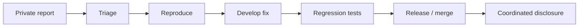

# Security Policy

## Supported Version

LeakGuard AI is currently in early development.

The actively maintained line is:

```text
0.1.x
```

Security fixes may be delivered directly on the primary development branch before a formal release process is established.

---

## Reporting a Vulnerability

Please do **not** publish a suspected vulnerability in a public issue before the project owner has had a reasonable opportunity to review it.

When reporting, include:

- affected version or commit
- operating system
- Python version
- reproduction steps
- expected behavior
- observed behavior
- security impact
- whether raw secret material was exposed
- whether the issue affects CLI, API, UI, Git scanning, Docker, or ML artifact loading

Do not include real active credentials.

Use synthetic or revoked examples.

---

## Sensitive Vulnerability Classes

Reports are especially valuable for issues involving:

- raw secret disclosure
- API scan-root escape
- symlink/junction boundary bypass
- staged Git coverage bypass
- remote dashboard API bypass
- ML artifact integrity bypass
- pickle loading before integrity verification
- deterministic finding suppression
- fail-open coverage behavior
- container privilege escalation caused by LeakGuard configuration
- absolute host-path leakage
- artifact propagation bypass

---

## Secret Material in Reports

Never submit:

```text
live API keys
live cloud credentials
private access tokens
real passwords
active signing keys
real customer secrets
```

Replace them with safe placeholders.

Example:

```text
REAL_SECRET_VALUE
```

should become:

```text
TEST_SECRET_REDACTED
```

---

## Expected Disclosure Process

A typical report lifecycle is:



---

## Security Design Principles

LeakGuard's current security model includes:

- local-first processing
- deterministic blocking authority
- masked public findings
- API filesystem containment
- loopback-only dashboard API destinations
- fail-closed coverage limitations
- SHA-256 model artifact verification before unpickling
- read-only container workspace/model mounts
- non-root container execution
- dropped Linux capabilities
- staged Git scanning

See:

```text
docs/security-model.md
docs/threat-model.md
docs/architecture.md
```

---

## Machine-Learning Security

Candidate v2 is advisory only.

A report is security-relevant if a change allows the model to:

- suppress deterministic findings
- independently pass/fail the gate
- become `blocking=true`
- masquerade as calibrated
- load an untrusted artifact
- bypass expected hash verification

---

## Out of Scope for Vulnerability Rewards

Unless a future program states otherwise, the following are generally engineering issues rather than security vulnerabilities:

- normal false positives
- normal false negatives within documented model limitations
- unsupported file formats
- unsupported artifact directories
- cosmetic UI problems
- performance complaints without a practical denial-of-service impact
- attacks requiring a fully compromised local administrator and no additional LeakGuard weakness

That said, reports showing a practical security-control bypass are welcome even if they begin from an apparently known limitation.

---

## Safe Research Rules

When testing LeakGuard:

- use synthetic repositories
- use fake credentials
- do not validate live tokens
- do not attack third-party systems
- do not exfiltrate data
- do not intentionally expose other users' information

---

## Dependency and Supply-Chain Reports

Dependency vulnerabilities are relevant when they affect LeakGuard's actual runtime or build path.

For ML artifacts, note that hash verification proves expected identity, not intrinsic pickle safety.

Changing the expected trusted hash is therefore a security-sensitive change.

---

## Security Regression Requirement

Security fixes should include a regression test whenever practical.

The preferred pattern is:

```text
reproduce failure
    |
    v
write failing test
    |
    v
implement fix
    |
    v
run targeted tests
    |
    v
run full suite
    |
    v
run deterministic self-scan
```

---

## No Credential Validation Service

LeakGuard does not intentionally validate whether discovered credentials are active against external providers.

Do not use live credentials when testing, demonstrating, reproducing, or reporting LeakGuard behavior.

Use only synthetic, intentionally fake, sanitized, or safely revoked credentials where appropriate.

Please do not request or implement "test this live key" behavior as part of vulnerability reproduction.
