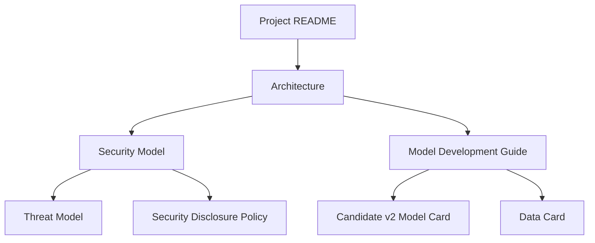

# LeakGuard AI Documentation

This directory contains the security, architecture, and machine-learning documentation for LeakGuard AI.

The documents are written so that a beginner can understand the system from first principles while an experienced engineer can inspect implementation boundaries, failure modes, and evaluation methodology.

---

## Recommended Reading Order

### Beginner

Start here:

1. `../README.md`
2. `architecture.md`
3. `model-development-guide.md`

You should finish with a clear mental model of:

- what LeakGuard scans
- why deterministic findings own blocking authority
- how the optional ML model works
- how the API, dashboard, and Docker topology fit together

### Intermediate

Continue with:

4. `security-model.md`
5. `threat-model.md`
6. `data-card.md`

These documents explain:

- trust assumptions
- security invariants
- attack surfaces
- data generation
- dataset separation
- failure modes

### Expert

Then read:

7. `model-card-candidate-v2.md`
8. `../SECURITY.md`

Pair the documentation with source code under:

```text
src/leakguard/
src/leakguard/ml/
scripts/
tests/
```

---

## Documentation Map



---

## Sources of Truth

Documentation should not redefine implementation constants independently.

Important implementation sources include:

| Concern | Source |
|---|---|
| Package version | `src/leakguard/version.py` |
| Runtime ports/hosts | `src/leakguard/runtime.py` |
| Source formats | `src/leakguard/scanner.py` |
| Artifact roots | `src/leakguard/artifacts.py` |
| Scan size limit | `src/leakguard/scan_safety.py` |
| API filesystem boundary | `src/leakguard/api/security.py` |
| Public scan orchestration | `src/leakguard/service.py` |
| ML authority config | `src/leakguard/config.py` |
| Locked fusion settings | `src/leakguard/ml/candidate_v2_locked.py` |
| Model artifact identity | `src/leakguard/ml/candidate_v2_distribution.py` |
| Independent benchmark | `reports/candidate_v2_holdout_benchmark_v1.json` |

The documentation contract test should fail if key claims drift away from these sources.

---

## Documentation Principles

LeakGuard documentation follows four rules:

1. **No hidden limitations.** Generalization gaps and false-positive risk are documented.
2. **No inflated ML claims.** Candidate v2 is advisory and uncalibrated.
3. **No secret-bearing examples.** Examples use safe placeholders.
4. **No architecture-by-marketing.** Trust boundaries must correspond to code.

---

## Mermaid Diagrams

GitHub renders Mermaid diagrams directly in Markdown.

If a local Markdown viewer does not render Mermaid, the source diagram remains readable as text.

---

## Updating Documentation

When implementation changes:

```text
Change code
   |
   v
Update tests
   |
   v
Update documentation
   |
   v
Run documentation contracts
   |
   v
Run full regression suite
   |
   v
Run LeakGuard self-scan
```

Documentation changes should be treated as engineering changes, not as an afterthought.
