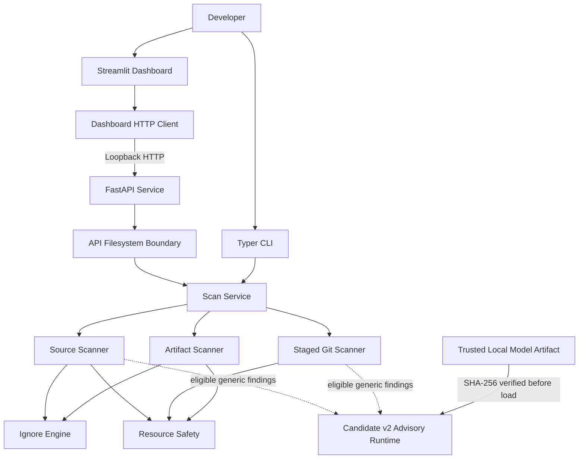
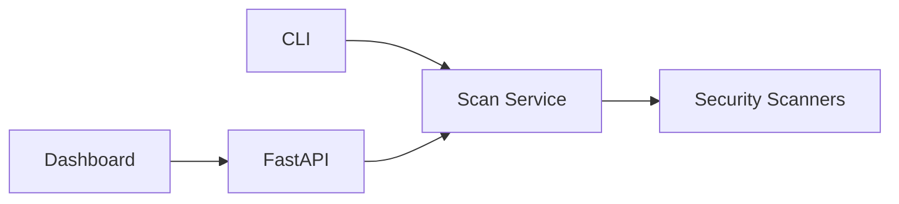
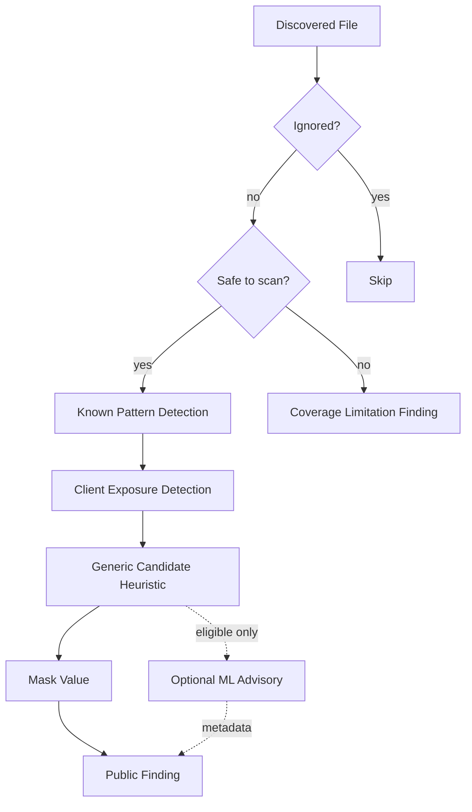
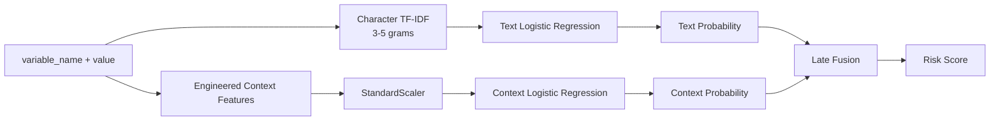
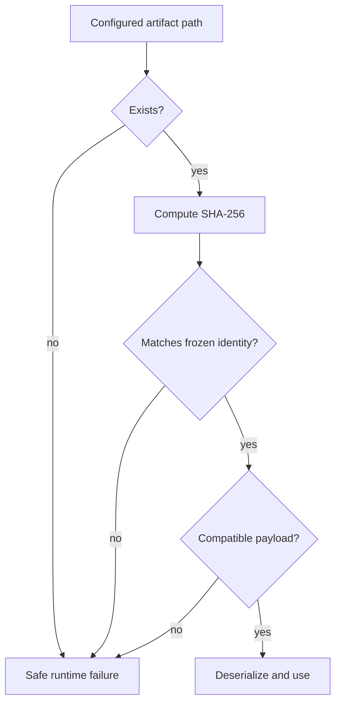
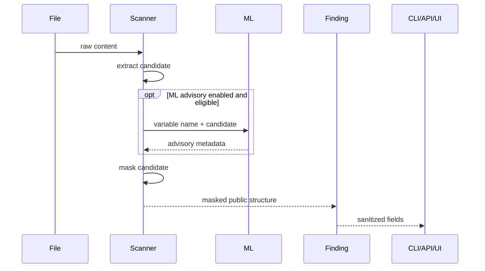
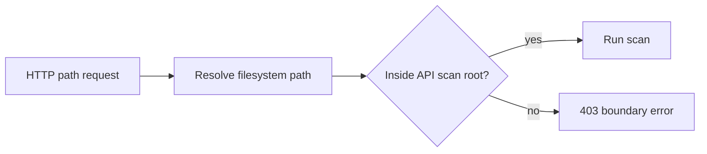

# LeakGuard AI Architecture

## 1. Purpose

This document describes the security-relevant architecture of LeakGuard AI.

It explains:

- major components
- data flow
- trust boundaries
- scan modes
- secret handling
- API containment
- dashboard network restrictions
- ML authority
- model artifact trust
- container deployment
- fail-closed behavior

The goal is to make the architecture understandable at three levels:

- **Beginner:** what each component does
- **Intermediate:** how components communicate
- **Expert:** where trust is placed and how failures are constrained

---

## 2. One-Minute Mental Model

LeakGuard has two kinds of logic:

```text
SECURITY AUTHORITY
------------------
Deterministic scanners
        |
        v
Findings
        |
        v
PASS / FAIL


OPTIONAL CONTEXT
----------------
Candidate v2 ML
        |
        v
Advisory metadata only
```

The machine-learning model is not the gatekeeper.

The deterministic findings are.

---

## 3. Major Components



---

## 4. Runtime Entrypoints

LeakGuard installs four console entrypoints:

```text
leakguard
leakguard-api
leakguard-ui
leakguard-stack
```

### `leakguard`

Primary CLI for:

- project scans
- staged scans
- ML advisory control
- model lifecycle commands
- version reporting

### `leakguard-api`

Starts the standard local FastAPI service:

```text
127.0.0.1:8000
```

### `leakguard-ui`

Starts the standard local Streamlit dashboard:

```text
127.0.0.1:8501
```

### `leakguard-stack`

Container-only orchestration.

It refuses to run unless:

```text
LEAKGUARD_CONTAINER_MODE=1
```

This prevents accidental use of the container-specific exposure model as an ordinary host runtime.

---

## 5. Presentation vs Security Logic

LeakGuard intentionally separates presentation layers from scanner logic.



Important consequences:

- The API does not shell out to the CLI.
- The UI does not import scanner internals.
- The dashboard must pass through API security boundaries.
- Public response sanitization remains centralized.

This reduces the number of privileged paths that can reach scanner internals.

---

## 6. Scan Modes

LeakGuard supports two primary scan modes.

### 6.1 Project scan

A normal scan combines:

```text
source scanner
+
artifact scanner
```

The source scanner deliberately excludes artifact-owned paths so that build outputs are not double-counted.

### 6.2 Staged scan

A staged scan reads Git index content.

This answers:

> What security-relevant content is actually staged for commit?

rather than:

> What is currently on disk?

This distinction matters because the working tree may differ from the index.

---

## 7. Source Scanner Scope

Supported source extensions:

```text
.py
.js
.jsx
.ts
.tsx
.json
.yaml
.yml
.html
```

Supported dotenv files:

```text
.env
.env.local
.env.development
.env.production
```

Built-in skipped directories:

```text
.git
.venv
__pycache__
node_modules
```

Project-specific ignore rules live in:

```text
.leakguardignore
```

---

## 8. Detection Pipeline

A simplified working-tree pipeline:



---

## 9. Detection Authority

| Layer | Purpose | Authority | Can independently fail gate? |
|---|---|---|---|
| Known secret patterns | Recognized secret formats | Deterministic | Yes |
| Client exposure | Dangerous frontend-visible values | Deterministic | Yes |
| Generic heuristic | Unknown secret-like assignments | Deterministic | Yes |
| Artifact propagation | Dotenv values copied into builds | Deterministic | Yes |
| Coverage limitation | Unsafe/incomplete scan coverage | Deterministic | Yes |
| Candidate v2 | Contextual advisory | Advisory only | No |

The gate invariant is:

```text
no findings  -> passed
any finding  -> failed
```

Candidate v2 cannot independently create, remove, suppress, or escalate deterministic findings.

---

## 10. Generic Candidate Heuristic

The generic candidate detector is not Candidate v2.

It uses engineered deterministic signals such as:

- sensitive variable naming
- value length
- entropy
- character variety

The heuristic produces a deterministic finding first.

Only then may Candidate v2 add advisory metadata.

---

## 11. Candidate v2 Boundary

Candidate v2 is an experimental late-fusion classifier.

Its public advisory representation contains fields equivalent to:

```text
available
model
mode
risk_score
threshold
prediction
calibrated
blocking
```

Required invariants:

```text
mode = advisory
blocking = false
calibrated = false
```

If the runtime returns advisory data that violates these invariants, the service treats it as invalid.

---

## 12. Candidate v2 Internal Architecture



Locked fusion:

```text
text weight    = 0.70
context weight = 0.30
threshold      = 0.50
```

The score is not calibrated.

---

## 13. Model Artifact Trust

The Candidate v2 artifact is not loaded blindly.



The trusted artifact filename is:

```text
candidate_v2_advisory_v1.pkl
```

The expected SHA-256 is frozen in source code.

This verification occurs before unpickling.

---

## 14. Secret Handling

Raw values may exist transiently inside the scanner process.

They are needed for:

- exact pattern checks
- entropy/context analysis
- build-artifact propagation comparison
- optional model scoring

The intended output lifecycle is:



Raw values are not intentionally copied into public findings.

---

## 15. Public Finding Boundary

The service constructs an explicit public finding structure.

Expected fields include:

```text
file
line
type
severity
masked_value
candidate_score
framework
reasons
ml_advisory
```

Unknown internal finding fields are discarded.

Absolute project paths are converted to project-relative display paths when possible.

Unexpected paths outside the project fall back to filename-only output rather than intentionally exposing the host filesystem path.

---

## 16. API Filesystem Boundary

The API has a configured scan root.

Priority:

```text
explicit application root
LEAKGUARD_API_SCAN_ROOT
current working directory
```

Requested paths are resolved before scanning.

The resolved path must remain inside the configured scan root.

This blocks:

- ordinary `..` traversal
- resolved symlink escapes



---

## 17. Dashboard Network Boundary

The dashboard API client only accepts loopback hosts.

Accepted endpoint requirements include:

- HTTP or HTTPS
- no username/password
- no query string
- no fragment
- no base path
- hostname must be `localhost` or a loopback IP

The purpose is to reduce the chance of accidentally sending local project paths to a remote endpoint.

---

## 18. Resource Safety

Maximum supported source-like file size:

```text
2 MiB
```

If a supported-looking file exceeds the limit, LeakGuard emits:

```text
Scan Coverage Limitation
Severity: MEDIUM
```

Strong binary evidence in a supported text format is handled similarly.

The scanner repeats size checks after reading as defense in depth against filesystem changes between metadata inspection and content access.

---

## 19. Artifact Propagation Scanning

Artifact roots:

```text
dist/
build/
.next/static/
```

Supported artifact extensions:

```text
.js
.mjs
.cjs
.css
.html
.json
.map
.txt
```

LeakGuard builds an in-memory inventory of eligible dotenv values and searches supported build outputs for exact propagation.

Raw values in the inventory are deliberately excluded from object representations.

Artifact propagation does not depend on Candidate v2.

---

## 20. Container Deployment Boundary

Standard host runtime:

```text
API -> 127.0.0.1:8000
UI  -> 127.0.0.1:8501
```

Container runtime:

```text
API -> 127.0.0.1:8000
UI  -> 0.0.0.0:8501
```

Provided Compose port mapping:

```text
127.0.0.1:8501:8501
```

No API host port is published.

Volumes:

```text
/workspace  read-only
/models     read-only
```

Additional hardening:

```text
no-new-privileges
cap_drop: ALL
non-root leakguard user
```

---

## 21. Container Trust Diagram

```mermaid
flowchart LR
    Browser[Host Browser]
    Published[127.0.0.1:8501]
    UI[Streamlit]
    API[FastAPI<br/>internal loopback]
    Workspace[/workspace<br/>read-only]
    Models[/models<br/>read-only]

    Browser --> Published
    Published --> UI
    UI --> API
    API --> Workspace
    API -. optional .-> Models
```

---

## 22. Staged Git Boundary

Staged scanning treats Git index entries as a separate security boundary.

Special Git modes such as symlinks and submodules are not assumed to be ordinary source files.

Unsupported or unsafe staged coverage is represented explicitly rather than silently accepted.

---

## 23. Trust Boundary Summary

| Boundary | Protected side | Constrained side | Enforcement |
|---|---|---|---|
| Project root | scanner-owned project | outside filesystem | project-relative ownership |
| API scan root | configured local root | HTTP path input | resolve + containment |
| Dashboard API | loopback service | arbitrary remote endpoint | loopback validation |
| Public finding | sanitized output | scanner internals | field whitelist |
| Raw candidate | scanner memory | presentation layers | masking |
| Gate authority | deterministic findings | ML prediction | advisory-only invariant |
| Model artifact | frozen trusted identity | arbitrary pickle | SHA-256 before load |
| Container API | internal service | host network | no API port publication |
| Workspace | scan input | container process | read-only bind |

---

## 24. Fail-Closed Conditions

Examples include:

```text
oversized supported files
binary evidence in supported text files
unsafe filesystem boundaries
invalid LeakGuard configuration
requested model unavailable
model integrity failure
API path escape attempts
unsupported staged filesystem states
```

Some failures mean "a secret was detected."

Others mean "safe coverage could not be established."

Both are intentionally different from silent success.

---

## 25. Non-Goals

LeakGuard does not currently claim to:

- replace enterprise secret-scanning products
- analyze arbitrary binary formats
- validate credentials against providers
- transmit secret candidates to remote LLMs
- use Candidate v2 as a sole blocking classifier
- provide calibrated ML probabilities
- scan every framework build directory
- detect every credential format

---

## 26. Architecture Review Checklist

When changing architecture, ask:

```text
Does this expose a new network surface?
Does this add a new filesystem trust boundary?
Can raw secrets cross a presentation boundary?
Can ML gain blocking authority?
Can a scan fail open?
Can a model artifact be loaded without integrity validation?
Can UI bypass API security?
Can staged content differ from what we believe we scanned?
```

If any answer changes, update this document and the threat model.
