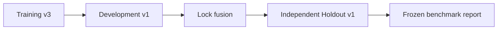
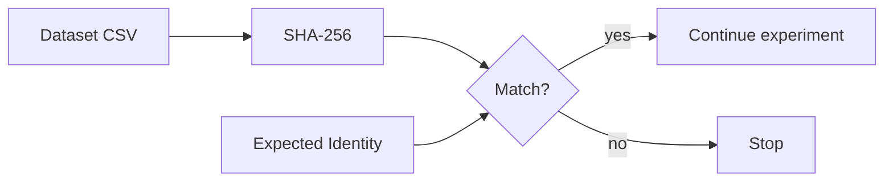

# Data Card — LeakGuard Candidate v2 Datasets

## 1. Purpose

This document describes the datasets used to develop and evaluate LeakGuard Candidate v2.

The goal is to make data provenance, intended use, separation, and limitations explicit.

---

## 2. Dataset Inventory

| Dataset | Purpose | Samples | Safe | Secret |
|---|---|---:|---:|---:|
| Synthetic Dataset v3 | Training | 2000 | 1000 | 1000 |
| Candidate v2 Dev v1 | Development / tuning | 600 | 300 | 300 |
| Candidate v2 Holdout v1 | Independent locked evaluation | 800 | 400 | 400 |

---

## 3. Frozen Dataset Identities

### Training

```text
data/processed/leakguard_synthetic_v3.csv

SHA-256:
e19ed8176cf3c00d2465c62d298375ba9bf51207656f0b411b09ff04aa991e83
```

### Development

```text
data/processed/leakguard_candidate_v2_dev_v1.csv

SHA-256:
02940249dce60658fd041e7b7a77a10b439fe79273f2b93cfccbbaf3d0d83bf2
```

### Independent holdout

```text
data/processed/leakguard_candidate_v2_holdout_v1.csv

SHA-256:
391d75e8a0fa5bc8776e5f466388c527d228a4cbef5debd96a5714843ff93bf7
```

Any unexpected file modification should stop the frozen experiment.

---

## 4. Label Semantics

```text
label = 1  -> secret / suspicious class
label = 0  -> safe / non-secret class
```

The model is binary.

The label does not mean:

```text
credential is live
credential is valid
credential belongs to a real user
credential was tested externally
```

---

## 5. Feature Inputs vs Diagnostic Metadata

Candidate v2 model inputs are derived from:

```text
variable_name
value
```

Diagnostic metadata such as:

```text
sample_type
framework
source
```

must not become model input.

This separation is important because metadata can leak dataset-generation shortcuts.

---

## 6. Dataset Lifecycle



The holdout must not flow backward into tuning.

Correct direction:

```text
training -> development -> lock parameters -> holdout
```

Incorrect direction:

```text
holdout result -> retune -> claim same holdout is independent
```

---

## 7. Training Dataset

Synthetic Dataset v3 contains:

```text
2000 total samples
1000 safe
1000 secret
source = synthetic_v3
```

The generation process is seeded.

The project validates:

- file SHA-256
- sample count
- source identity
- label distribution

before frozen model evaluation/export.

---

## 8. Development Dataset

Candidate v2 Dev v1 contains:

```text
600 total samples
300 safe
300 secret
source = candidate_v2_dev_v1
```

It is explicitly a development set.

It may be inspected for:

- errors
- fusion weights
- threshold selection
- complementarity
- false positive patterns
- false negative patterns

Once inspected, it must not be described as untouched final evaluation data.

---

## 9. Independent Holdout

Candidate v2 Holdout v1 contains:

```text
800 total samples
400 safe
400 secret
source = candidate_v2_holdout_v1
```

The project checks strict separation between:

```text
training <-> holdout
development <-> holdout
```

The holdout is used for locked evaluation only.

---

## 10. Why Hashes Matter

A dataset hash is a fingerprint.



Without frozen identities, a dataset can silently change while metrics keep the same label.

That makes experiment history difficult to trust.

---

## 11. Synthetic Data Strengths

Synthetic data provides:

- safe development without real credentials
- controllable class balance
- reproducibility through seeds
- deliberate hard-negative design
- scalable experimentation

---

## 12. Synthetic Data Limitations

Synthetic data may fail to reproduce:

- real repository naming conventions
- organization-specific patterns
- accidental developer behavior
- minified/transformed artifacts
- provider-specific token evolution
- messy legacy code
- framework-specific context
- real secret rotation history

This is a major reason the holdout gap matters.

---

## 13. Privacy

The intended data policy is:

```text
synthetic by default
no live credential validation
no intentional collection of real private secrets
```

Future real-world evaluation should prefer:

- sanitized datasets
- revoked credentials
- public benchmark material with clear licensing
- synthetic transformations that do not preserve real credentials

---

## 14. Bias and Coverage

Potential dataset biases include:

- balanced class distributions unlike real repositories
- overrepresentation of generator-defined secret shapes
- insufficient language/framework diversity
- variable-name shortcuts
- length/entropy distributions that differ from production systems

A classifier can exploit these biases while appearing strong on similar synthetic data.

---

## 15. Data Leakage Risks

### Metadata leakage

Using `source` or `sample_type` as features.

LeakGuard avoids this in Candidate v2 feature construction.

### Duplicate leakage

Near-identical examples across train/dev/holdout.

Dataset-separation checks should protect against direct overlap according to the project's strict separation rules.

### Human leakage

A developer manually inspects holdout errors and retunes the same model.

Process policy is required; code alone cannot fully prevent human leakage.

---

## 16. Reproducing the Datasets

Training:

```bash
python scripts/generate_dataset_v3.py
```

Development:

```bash
python scripts/generate_candidate_v2_devset.py
```

Holdout:

```bash
python scripts/generate_candidate_v2_holdout.py
```

After generation, verify hashes before treating the files as the frozen Candidate v2 datasets.

---

## 17. Data Quality Checklist

Before training a future model:

```text
[ ] no real active secrets
[ ] labels documented
[ ] class counts reviewed
[ ] source identities documented
[ ] duplicates checked
[ ] train/dev/holdout separated
[ ] dataset hashes frozen
[ ] metadata leakage reviewed
[ ] hard negatives inspected
[ ] subgroup coverage inspected
[ ] licensing/privacy reviewed
```

---

## 18. Future Dataset Strategy

Candidate v3 should expand beyond purely synthetic distributions.

Recommended sources:

- sanitized open-source repository examples
- revoked credential corpora where legally usable
- realistic generated configuration files
- framework-specific frontend builds
- safe hashes and identifiers as hard negatives
- long benign random identifiers
- UUIDs
- checksums
- package integrity hashes
- deployment metadata

Each new source should receive:

- provenance documentation
- licensing review
- privacy review
- frozen identity
- split policy
- contamination checks
