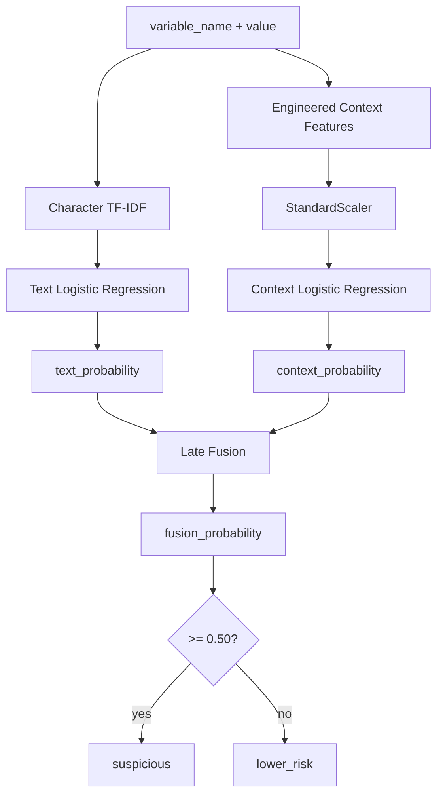

# Model Card — LeakGuard Candidate v2

## 1. Model Summary

**Model name:** LeakGuard Candidate v2 Locked Late Fusion  
**Role:** Experimental advisory classifier  
**Authority:** Non-blocking  
**Calibration:** Not calibrated  
**Primary input:** `variable_name` and candidate `value`  
**Primary output:** advisory risk score and binary advisory prediction

Candidate v2 is not the security gate.

It provides contextual assistance for eligible generic deterministic findings.

---

## 2. Intended Use

Candidate v2 is intended to answer a narrow question:

> Given a generic secret-like assignment already identified by deterministic logic, does its lexical/contextual structure look more suspicious or lower-risk?

It is **not** intended to:

- independently discover all secrets
- suppress deterministic findings
- determine severity
- validate live credentials
- provide calibrated probabilities
- replace provider-specific rules

---

## 3. Architecture

Candidate v2 contains two Logistic Regression branches.



---

## 4. Text Branch

The text branch constructs:

```text
variable_name = value
```

It uses:

```text
TfidfVectorizer
analyzer = character
ngram range = 3 to 5
min_df = 2
sublinear_tf = true
```

The classifier is:

```text
LogisticRegression
max_iter = 1500
random_state = 42
```

### Why character n-grams?

They can learn local lexical patterns without requiring a programming-language parser, for example:

- token-like prefixes
- delimiter structure
- repeated alphabet families
- variable-name/value interactions

---

## 5. Context Branch

The context branch recomputes engineered features directly from:

```text
variable_name
value
```

Dataset metadata such as:

```text
sample_type
framework
source
```

is not used as a model feature.

The context branch includes existing numerical candidate features plus contextual indicators such as:

```text
looks_like_uuid
looks_like_fixed_hash
is_hex_only
looks_like_reference
looks_like_placeholder
has_public_frontend_prefix
has_identifier_name
looks_like_jwt
looks_like_passphrase
looks_like_safe_hash_metadata
```

Pipeline:

```text
StandardScaler
    |
    v
LogisticRegression
```

Classifier configuration:

```text
max_iter = 1500
random_state = 42
```

---

## 6. Late Fusion

The locked fusion rule is:

```text
fusion_probability
    =
0.70 * text_probability
    +
0.30 * context_probability
```

Decision:

```text
suspicious if fusion_probability >= 0.50
```

Locked values:

| Parameter | Value |
|---|---:|
| Text weight | `0.70` |
| Context weight | `0.30` |
| Threshold | `0.50` |
| Minimum development recall target | `0.98` |

Selection policy:

> Require recall >= 0.98, then maximize precision, then F1, then minimize false positives.

---

## 7. Data

### Training

```text
Dataset: Synthetic Dataset v3
Samples: 2000
Safe: 1000
Secret: 1000
SHA-256:
e19ed8176cf3c00d2465c62d298375ba9bf51207656f0b411b09ff04aa991e83
```

### Development

```text
Dataset: Candidate v2 Dev v1
Samples: 600
Safe: 300
Secret: 300
SHA-256:
02940249dce60658fd041e7b7a77a10b439fe79273f2b93cfccbbaf3d0d83bf2
```

The development set was used for model/fusion selection.

It is not an independent final benchmark after inspection.

### Independent holdout

```text
Dataset: Candidate v2 Holdout v1
Samples: 800
Safe: 400
Secret: 400
SHA-256:
391d75e8a0fa5bc8776e5f466388c527d228a4cbef5debd96a5714843ff93bf7
```

The locked parameters were evaluated on this holdout without retuning from the result.

---

## 8. Independent Holdout Performance

| Metric | Result |
|---|---:|
| Accuracy | `0.79875` |
| Precision | `0.75699` |
| Recall | `0.88000` |
| F1 | `0.81387` |
| ROC AUC | `0.89615` |
| True positives | `352` |
| True negatives | `287` |
| False positives | `113` |
| False negatives | `48` |

Confusion matrix:

```text
                 Predicted
              Safe   Suspicious
Actual Safe    287      113
Actual Secret   48      352
```

Equivalent rates on the balanced holdout:

```text
secret miss rate = 48 / 400 = 12.0%
safe false-positive rate = 113 / 400 = 28.25%
```

These numbers are the main reason Candidate v2 is not allowed to become the sole blocker.

---

## 9. Development vs Holdout

The development result was materially stronger than the independent holdout.

That gap should be treated as evidence of limited generalization.

The correct engineering response is not to hide the gap.

The correct response is:

```text
keep Candidate v2 advisory
document the gap
collect better data
design Candidate v3
preserve the holdout as evidence
```

---

## 10. Public Runtime Output

Candidate v2 advisory output is sanitized to a structure equivalent to:

```python
{
    "available": True,
    "model": "candidate-v2",
    "mode": "advisory",
    "risk_score": 0.0,
    "threshold": 0.50,
    "prediction": "suspicious",
    "calibrated": False,
    "blocking": False,
}
```

`risk_score` is not a calibrated probability.

---

## 11. Model Artifact

Runtime artifact:

```text
candidate_v2_advisory_v1.pkl
```

Expected trusted SHA-256:

```text
a43e841c1b01468fe02fa084c3b665a96f3d74b8bdb57a622697067c3f9e96e5
```

The runtime verifies this identity before unpickling.

---

## 12. Safety Constraints

Candidate v2 is only allowed to score eligible generic candidates.

It is not required for:

- known secret patterns
- client-side exposure findings
- artifact propagation findings
- coverage limitation findings

The model cannot:

```text
create finding authority
remove finding authority
change severity
be configured as blocking
```

---

## 13. Limitations

### Synthetic-data dependence

Training and evaluation data are synthetic.

Synthetic datasets are useful for controlled experiments but do not guarantee real-world generalization.

### Holdout gap

The independent holdout shows a meaningful performance drop.

### False positives

28.25% of safe holdout samples were classified suspicious at the locked threshold.

### False negatives

12% of secret holdout samples were missed by the advisory classifier.

### No calibration

Scores must not be interpreted as probabilities.

### Dependency reproducibility

The current project specifies broad dependency ranges rather than a fully pinned ML lockfile.

Re-training on future library versions may not produce bit-for-bit identical serialized artifacts.

### Narrow task

Candidate v2 evaluates generic assignment candidates. It is not a universal source-code security model.

---

## 14. Ethical and Security Considerations

Use only:

- synthetic credentials
- sanitized examples
- intentionally fake values
- revoked credentials when legally and ethically appropriate

Do not:

- validate live credentials
- upload real secrets to third-party services
- treat the model score as proof of validity
- publish raw secret-bearing datasets

---

## 15. Recommended Future Work

Candidate v3 should prioritize:

1. real-world sanitized/revoked examples
2. stronger dataset diversity
3. repository-level contextual features
4. calibrated evaluation
5. subgroup error analysis
6. larger untouched holdouts
7. reproducible dependency locking
8. possible code-aware transformer comparison
9. threshold decisions tied to a documented utility function
10. continued separation between ML and deterministic blocking authority

---

## 16. Decision Statement

Candidate v2 is useful as an experimental contextual advisor.

It is **not sufficiently validated to become an independent security gate**.

That limitation is a design input, not a documentation footnote.
