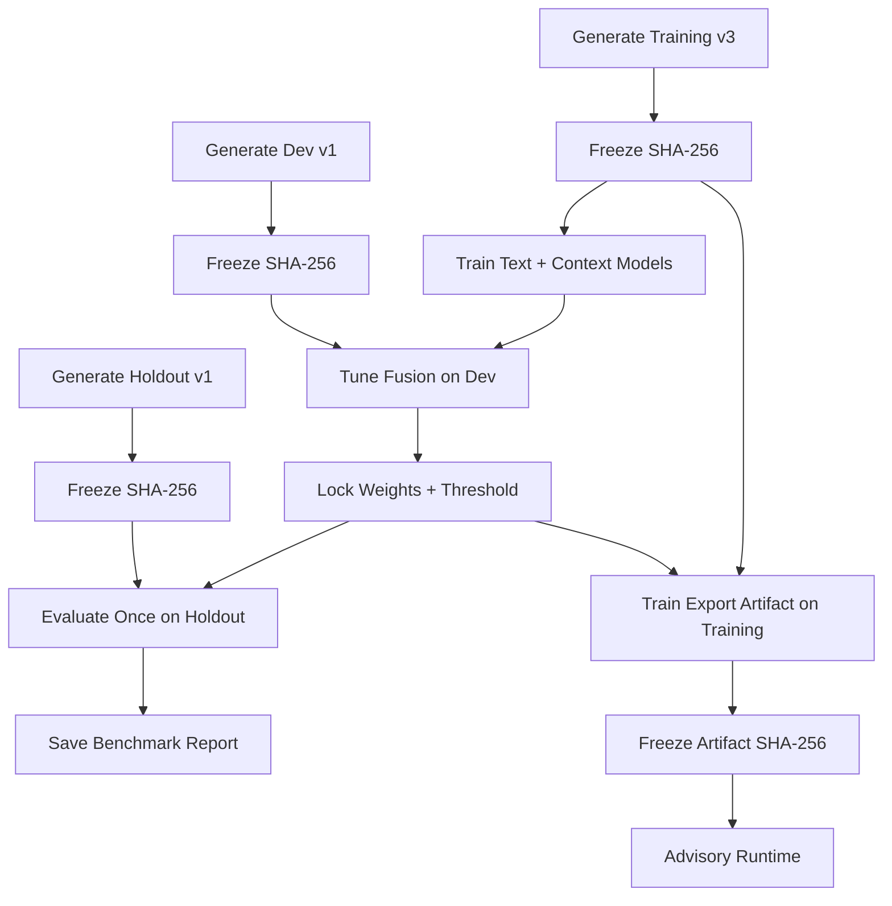
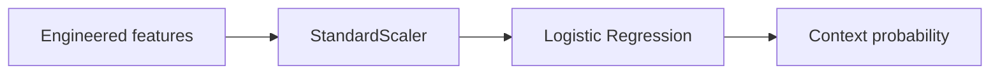
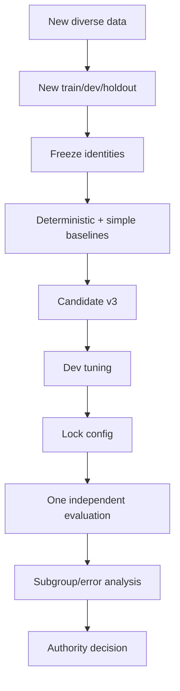

# Building LeakGuard Candidate v2 — Development Guide

## 1. Who This Guide Is For

This guide explains how Candidate v2 is built from the ground up.

It is intentionally layered:

- **Beginner:** understand the idea and run the scripts
- **Intermediate:** understand the data, features, and evaluation
- **Expert:** inspect leakage controls, fusion policy, artifact trust, and reproducibility limitations

You do not need deep machine-learning experience to follow the first half.

---

## 2. What Are We Building?

Candidate v2 is not a giant neural network.

It is a deliberately interpretable late-fusion system:

```text
Text Logistic Regression
        +
Context Logistic Regression
        |
        v
Weighted late fusion
        |
        v
Advisory risk score
```

Why this design?

Because the project needs:

- fast local inference
- easy inspection
- small artifact size
- deterministic training code
- understandable features
- low operational complexity

---

## 3. Prerequisites

Project requirements:

```text
Python >= 3.11
pandas
scikit-learn
pytest
```

Install the development environment:

```bash
python -m venv .venv
```

Activate it.

Then:

```bash
python -m pip install -e ".[dev]"
```

Check:

```bash
python --version
pytest --version
leakguard version
```

---

## 4. Repository Map for ML Work

Key files:

```text
data/processed/
    leakguard_synthetic_v3.csv
    leakguard_candidate_v2_dev_v1.csv
    leakguard_candidate_v2_holdout_v1.csv

src/leakguard/ml/
    dataset_v3.py
    candidate_v2_devset.py
    candidate_v2_holdout.py
    context_features.py
    context_baseline.py
    candidate_v2_complementarity.py
    candidate_v2_fusion.py
    candidate_v2_locked.py
    fresh_dev_gate.py
    candidate_v2_holdout_gate.py
    candidate_v2_artifact.py
    candidate_v2_runtime.py

scripts/
    generate_dataset_v3.py
    generate_candidate_v2_devset.py
    generate_candidate_v2_holdout.py
    tune_candidate_v2_fusion.py
    run_candidate_v2_holdout_benchmark.py
    export_candidate_v2_artifact.py
```

---

## 5. End-to-End Pipeline



---

## 6. Step 1 — Generate Training Data

Run:

```bash
python scripts/generate_dataset_v3.py
```

Expected frozen shape:

```text
2000 samples
1000 secret
1000 safe
source = synthetic_v3
```

Frozen SHA-256:

```text
e19ed8176cf3c00d2465c62d298375ba9bf51207656f0b411b09ff04aa991e83
```

### Beginner explanation

A training dataset is the material the model learns from.

Each row has a label:

```text
1 = secret-like
0 = safe
```

### Expert note

Never trust filename alone.

The frozen experiment validates:

- SHA-256
- sample count
- source column
- exact label counts

---

## 7. Step 2 — Generate Development Data

Run:

```bash
python scripts/generate_candidate_v2_devset.py
```

Expected:

```text
600 samples
300 secret
300 safe
source = candidate_v2_dev_v1
```

Frozen SHA-256:

```text
02940249dce60658fd041e7b7a77a10b439fe79273f2b93cfccbbaf3d0d83bf2
```

### Why a development set?

The development set is where we answer questions such as:

```text
Should text probability have 60% or 70% weight?
Should the threshold be 0.45 or 0.50?
Which configuration preserves high recall?
```

Because we inspect and tune using this set, it is not a final untouched benchmark.

---

## 8. Step 3 — Generate the Independent Holdout

Run:

```bash
python scripts/generate_candidate_v2_holdout.py
```

Expected:

```text
800 samples
400 secret
400 safe
source = candidate_v2_holdout_v1
```

Frozen SHA-256:

```text
391d75e8a0fa5bc8776e5f466388c527d228a4cbef5debd96a5714843ff93bf7
```

### Critical rule

Do not tune from this dataset.

The holdout exists to answer:

> Did our locked design generalize to data we did not use for selection?

---

## 9. Step 4 — Understand the Text Model

The text branch builds this input:

```text
VARIABLE_NAME = candidate_value
```

Example with safe synthetic text:

```text
SERVICE_TOKEN = demo_value_123
```

Then it applies character TF-IDF.

Configuration:

```text
analyzer = char
ngram_range = (3, 5)
min_df = 2
sublinear_tf = true
```

Then:

```text
LogisticRegression(
    max_iter=1500,
    random_state=42
)
```

### What is TF-IDF?

A beginner-friendly intuition:

TF-IDF converts text fragments into numbers.

With character 3-5 grams, the model sees fragments such as:

```text
SER
ERV
RVI
VICE
_TOKEN
```

and fragments inside values.

It learns which local patterns are associated with secret-like vs safe examples.

---

## 10. Step 5 — Understand the Context Model

The context branch extracts engineered features from:

```text
variable_name
value
```

Examples include indicators for:

```text
UUID-like values
fixed hashes
hex-only strings
references
placeholders
public frontend prefixes
identifier-like names
JWT-like structure
passphrase-like values
safe hash metadata
```

The pipeline is:



Why scaling?

Logistic Regression behaves better when numerical features have comparable scale.

---

## 11. Step 6 — Train Both Branches

The fusion code trains both models on Synthetic Dataset v3.

Conceptually:

```python
context_model.fit(training_features, labels)
text_model.fit(training_text, labels)
```

Then both predict probabilities on the development set:

```text
context_probability
text_probability
```

Dataset diagnostic metadata is preserved for analysis but is not used as a model feature.

---

## 12. Step 7 — Tune Late Fusion

Run:

```bash
python scripts/tune_candidate_v2_fusion.py
```

The search is deliberately coarse.

Text-weight candidates:

```text
0.40
0.50
0.60
0.70
0.80
0.90
```

Threshold candidates:

```text
0.35
0.40
0.45
0.50
0.55
0.60
0.65
```

Fusion formula:

```text
context_weight = 1 - text_weight

fusion_probability
    =
text_weight * text_probability
    +
context_weight * context_probability
```

---

## 13. Why Late Fusion?

Text and context models make different kinds of mistakes.

Example:

```text
A random-looking checksum:
text model -> suspicious
context model -> safe metadata
```

Another example:

```text
A token-like string with an unusual variable name:
text model -> suspicious
context model -> uncertain
```

Late fusion allows both views to contribute.

---

## 14. Step 8 — Lock the Configuration

Candidate v2 locks:

```text
text weight    = 0.70
context weight = 0.30
threshold      = 0.50
```

Selection policy:

```text
Require recall >= 0.98,
then maximize precision,
then F1,
then minimize false positives.
```

### Why lock before holdout?

Because choosing settings after seeing holdout performance would make the holdout part of tuning.

Then it would no longer be independent.

---

## 15. Step 9 — Verify Dataset Separation

Before holdout evaluation, the project validates:

```text
training vs holdout
development vs holdout
```

The holdout must pass strict separation checks from both.

This is a critical anti-leakage control.

---

## 16. Step 10 — Run Independent Holdout Benchmark

The project already contains a frozen benchmark report.

The benchmark script is intentionally defensive:

```text
If the report already exists:
    refuse to overwrite it
```

This protects against casually rerunning the same holdout until a desirable result appears.

The original benchmark command is:

```bash
python scripts/run_candidate_v2_holdout_benchmark.py
```

Do **not** delete the frozen report just to rerun and retune the same model.

---

## 17. Holdout Result

Locked Candidate v2 achieved:

```text
Accuracy   0.79875
Precision  0.75699
Recall     0.88000
F1         0.81387
ROC AUC    0.89615

TP 352
TN 287
FP 113
FN 48
```

Confusion matrix:

```text
                    Predicted
                 Safe  Suspicious
Actual Safe       287      113
Actual Secret      48      352
```

Important interpretation:

```text
48 / 400 secret examples missed = 12% miss rate
113 / 400 safe examples flagged = 28.25% safe false-positive rate
```

This is not strong enough for sole blocking authority.

---

## 18. Step 11 — Export the Advisory Artifact

Run:

```bash
python scripts/export_candidate_v2_artifact.py
```

The script:

1. validates the frozen training dataset
2. builds the Candidate v2 payload
3. trains the required model components
4. includes locked fusion metadata
5. saves the artifact
6. prints the artifact SHA-256

Output path:

```text
models/candidate_v2_advisory_v1.pkl
```

Trusted current artifact SHA-256:

```text
a43e841c1b01468fe02fa084c3b665a96f3d74b8bdb57a622697067c3f9e96e5
```

---

## 19. Step 12 — Freeze Artifact Identity

The trusted SHA-256 is encoded in:

```text
src/leakguard/ml/candidate_v2_distribution.py
```

Runtime behavior:

```text
compute artifact SHA-256
       |
       v
compare with frozen expected SHA
       |
   +---+---+
   |       |
 match   mismatch
   |       |
 load    reject
```

Verification happens before unpickling.

---

## 20. Step 13 — Install the Artifact

Use:

```bash
leakguard model install models/candidate_v2_advisory_v1.pkl
```

Then:

```bash
leakguard model status
```

The default model location is platform-specific.

It can be overridden using:

```text
LEAKGUARD_MODEL_HOME
```

---

## 21. Step 14 — Run Advisory Scoring

Example:

```bash
leakguard scan . --ml-advisory
```

Candidate v2 is only applied to eligible generic deterministic candidates.

Known-pattern and artifact findings do not depend on it.

---

## 22. Runtime Decision Structure

Conceptually:

```python
{
    "mode": "advisory",
    "risk_score": fusion_probability,
    "threshold": 0.50,
    "prediction": "suspicious" or "lower_risk",
    "calibrated": False,
    "blocking": False,
}
```

This metadata is attached to a finding.

It does not become a new security authority.

---

## 23. How to Evaluate a Future Candidate v3

Do not reuse the same experimental logic casually.

A stronger process:



---

## 24. Metrics Beginners Should Understand

### Recall

Of all real secret examples:

> How many did we catch?

Security scanning usually cares strongly about recall.

### Precision

Of everything the model called suspicious:

> How much was actually secret-like?

Low precision means developer fatigue.

### F1

Balances precision and recall.

### ROC AUC

Measures ranking quality across thresholds.

It does not tell you the operational false-positive rate at your chosen threshold by itself.

---

## 25. Why Accuracy Is Not Enough

Suppose a real repository has:

```text
99.9% safe values
0.1% secrets
```

A model that predicts "safe" for everything gets 99.9% accuracy and is useless.

Therefore LeakGuard evaluates:

```text
precision
recall
F1
ROC AUC
false positives
false negatives
```

---

## 26. Error Analysis

After development evaluation, inspect:

```text
false positives
false negatives
sample types
model complementarity
context coefficients
```

Do not blindly optimize one aggregate number.

Ask:

```text
What kinds of safe values are repeatedly flagged?
What kinds of secrets are repeatedly missed?
Is the model learning variable names instead of secret structure?
Is the text branch fixing context errors?
Is the context branch fixing text errors?
```

---

## 27. Reproducibility Warning

Dataset identities and model logic are frozen.

However, the current dependency declarations are not a complete bit-for-bit ML lockfile.

Libraries such as:

```text
pandas
scikit-learn
numpy
joblib
```

may change behavior or serialization across versions.

Therefore:

- reproducible methodology is strong
- exact artifact-byte reproduction across arbitrary future environments is not guaranteed

A future release process should pin training dependencies and record them in model metadata.

---

## 28. Security Warning About Pickle

Never modify the trusted SHA just because an unknown artifact fails verification.

Pickle-compatible artifacts can execute code during loading.

The trust process must be:

```text
build in trusted environment
review provenance
compute hash
freeze hash in code
only then distribute/load
```

---

## 29. Beginner Checklist

If you only want to understand the pipeline:

```text
[ ] read README
[ ] generate training data
[ ] generate development data
[ ] understand text branch
[ ] understand context branch
[ ] run fusion development analysis
[ ] understand why holdout must stay untouched
[ ] read holdout benchmark report
[ ] understand why model stays advisory
```

---

## 30. Intermediate Checklist

```text
[ ] inspect context feature extraction
[ ] inspect character TF-IDF configuration
[ ] inspect fusion grid
[ ] inspect false positives
[ ] inspect false negatives
[ ] verify dataset hashes
[ ] verify strict dataset separation
[ ] inspect model artifact metadata
```

---

## 31. Expert Checklist

```text
[ ] audit for feature leakage
[ ] audit train/dev/holdout contamination
[ ] evaluate subgroup metrics
[ ] add calibration analysis
[ ] benchmark real sanitized distributions
[ ] pin ML dependencies
[ ] design signed artifact distribution
[ ] compare against non-ML heuristic baseline
[ ] compare against stronger code-aware models
[ ] preserve independent holdout discipline
```

---

## 32. Final Principle

A security ML model should earn authority through evidence.

Candidate v2 has not earned independent blocking authority.

LeakGuard therefore uses it exactly where the evidence supports it:

> as an optional, local, experimental advisory signal.
