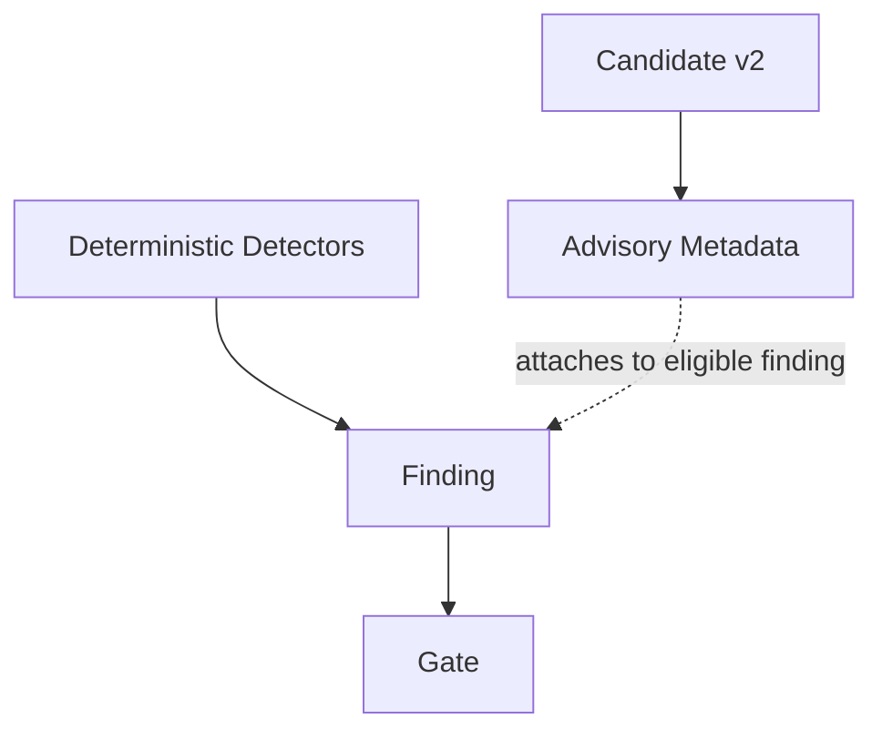
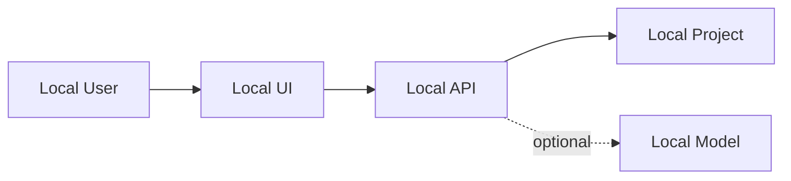
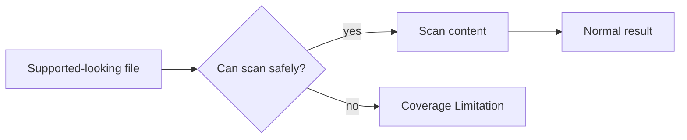

# LeakGuard AI Security Model

## 1. Purpose

This document defines the security assumptions, invariants, authority model, and failure philosophy of LeakGuard AI.

Architecture explains **how the system is connected**.

The security model explains **what must remain true for the system to be trusted**.

---

## 2. Security Objective

LeakGuard's primary objective is:

> Detect likely secret exposure before code or build outputs are shipped, while minimizing unnecessary disclosure of the values being inspected.

A secondary objective is:

> Make incomplete scan coverage visible rather than silently claiming success.

---

## 3. Core Security Invariants

### Invariant 1 — Deterministic findings own gate authority

```text
ML prediction != security authority
```

Candidate v2 cannot independently make the gate pass or fail.

### Invariant 2 — Public findings are masked

Raw candidate values must not intentionally appear in:

- CLI findings
- API responses
- dashboard findings

### Invariant 3 — API filesystem access is bounded

HTTP requests cannot intentionally scan outside the configured API scan root.

### Invariant 4 — Dashboard API communication is local-first

The dashboard cannot be configured to target arbitrary remote API hosts.

### Invariant 5 — Unsafe supported coverage fails closed

If a supported-looking file cannot be inspected safely, the result is a coverage finding.

### Invariant 6 — ML artifacts are integrity-checked

The trusted Candidate v2 pickle is verified against a frozen SHA-256 identity before deserialization.

### Invariant 7 — Container exposure is intentionally narrow

The supplied container publishes only the dashboard port to host loopback.

### Invariant 8 — Staged scanning evaluates staged content

The Git index is treated as a separate input boundary from the working tree.

---

## 4. Authority Hierarchy



Candidate v2 is subordinate to deterministic findings.

This design exists because:

- secret detection is a security-control problem
- ML can generalize imperfectly
- model scores are not calibrated
- a classifier should not silently erase deterministic evidence

---

## 5. Data Sensitivity Classes

### Class A — Raw secret candidates

Most sensitive.

Examples:

```text
candidate raw value
dotenv value used for artifact matching
raw assignment literal
```

Allowed locations:

```text
scanner process memory
temporary model scoring call
temporary artifact comparison state
```

Not intended for:

```text
public findings
API output
dashboard output
logs
```

### Class B — Masked findings

Examples:

```text
abcd********wxyz
```

Suitable for presentation layers.

### Class C — Metadata

Examples:

```text
file path
line number
severity
detector type
candidate score
ML risk score
```

Still security-relevant, but less sensitive than the raw secret value.

---

## 6. Local-First Model

Standard runtime:



There is no architectural requirement to send raw candidates to an external LLM or provider.

---

## 7. Filesystem Security

### Working-tree scanner

The scanner operates relative to an explicit project root.

Built-in skip directories and ignore patterns are evaluated relative to that root.

### API scanner

HTTP path requests are resolved and must remain under the configured API scan root.

### Container scanner

The supplied Compose configuration mounts `/workspace` read-only.

This reduces the scanner's ability to modify the project being inspected.

---

## 8. Network Security

### Standard host runtime

```text
FastAPI    127.0.0.1:8000
Streamlit  127.0.0.1:8501
```

### Dashboard API validation

The dashboard restricts API destinations to loopback.

### Container runtime

The API remains internal on loopback.

Only the Streamlit UI is published to host loopback.

---

## 9. Machine-Learning Security

Candidate v2 introduces special risks because its artifact is serialized with pickle-compatible mechanisms.

LeakGuard mitigates this by:

1. defining a trusted artifact identity in source
2. hashing the artifact before deserialization
3. refusing SHA-256 mismatch
4. refusing incompatible payloads
5. keeping ML optional
6. keeping ML non-blocking

### Important residual risk

Hash verification proves:

> "This file is the file LeakGuard expects."

It does not prove:

> "Pickle is intrinsically safe."

Therefore, changing the expected artifact hash is a security-sensitive code change.

---

## 10. Configuration Security

Supported ML configuration:

```toml
[ml]
enabled = false
mode = "advisory"
```

Unknown ML keys are rejected.

Unsupported authority modes are rejected.

This prevents configuration from silently inventing a `blocking=true` mode that the security architecture does not support.

---

## 11. Output Security

The service sanitizes findings before they reach API presentation.

The public structure is intentionally whitelisted.

Unknown internal fields are discarded.

This reduces accidental leakage when scanner internals evolve.

---

## 12. Error Handling

Security-sensitive errors should not reveal unnecessary internal details.

API responses use stable public error envelopes for cases such as:

- invalid request
- path outside scan root
- project not found
- invalid configuration
- scan failure
- internal error

Unexpected exception internals are not intended to be reflected to clients.

---

## 13. Fail-Closed Philosophy

LeakGuard treats several incomplete-coverage conditions as findings.

Example:



The scanner should never silently convert "I could not inspect this safely" into "no secrets found."

---

## 14. Security Assumptions

LeakGuard assumes:

- the local operating system is not fully compromised
- the Python interpreter and installed package environment are trustworthy enough to execute the scanner
- the project owner controls which model artifact hash is trusted
- Git itself provides a usable representation of staged content
- read-only Docker mounts are enforced by the container runtime
- local loopback restrictions are meaningful on the host

If the host is already malicious, LeakGuard cannot guarantee confidentiality of in-process secret values.

---

## 15. Out of Scope

The current security model does not attempt to provide:

- sandboxing against a hostile Python interpreter
- arbitrary untrusted plugin execution
- live credential validation
- provider-side revocation
- general malware analysis
- arbitrary binary reverse engineering
- full supply-chain attestation
- remote multi-tenant isolation

---

## 16. Security Decision Table

| Situation | Expected behavior |
|---|---|
| Known secret detected | deterministic finding; gate fails |
| Generic suspicious assignment | deterministic finding; gate fails |
| Candidate v2 says lower risk | finding remains; gate still fails |
| Candidate v2 unavailable while disabled | normal deterministic scan |
| Candidate v2 requested but artifact missing | safe configuration failure |
| Artifact hash mismatch | reject model |
| File exceeds safe scan size | coverage finding |
| Binary evidence in supported text file | coverage finding |
| API path escapes scan root | reject request |
| Dashboard remote API URL | reject configuration |
| Build contains dotenv value | deterministic critical artifact finding |

---

## 17. Security Review Questions

Before merging a security-sensitive change, ask:

- Does this change who can create or suppress findings?
- Does this expose raw values to a new layer?
- Does this create a new remote endpoint?
- Does this expand the filesystem boundary?
- Does this introduce a new serialized artifact?
- Does this convert a fail-closed case into a skip?
- Does this make ML authoritative?
- Does this change the trusted artifact hash?
- Does this weaken staged-content guarantees?

---

## 18. Relationship to Threat Model

This document defines invariants.

`threat-model.md` asks how an attacker or unsafe condition might violate them.

Both documents should evolve together.
