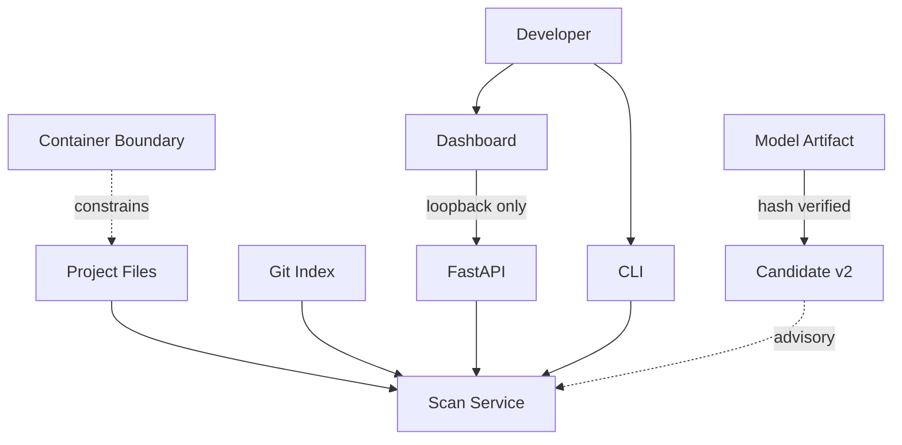

# LeakGuard AI Threat Model

## 1. Scope

This threat model covers the current LeakGuard AI architecture:

- CLI scanning
- staged Git scanning
- artifact scanning
- FastAPI service
- Streamlit dashboard
- Candidate v2 local ML advisory
- model artifact lifecycle
- supplied Docker deployment

It focuses on accidental secret exposure and abuse of LeakGuard's trust boundaries.

---

## 2. Assets

Protected assets include:

### Primary assets

- raw secret candidates
- dotenv values
- source-code contents
- local project paths
- staged Git content
- model artifact trust identity

### Secondary assets

- finding integrity
- gate decision integrity
- scan coverage integrity
- API boundary integrity
- benchmark validity
- dataset separation guarantees

---

## 3. Actors

### Developer

Normal user running scans locally.

### CI Runner

Executes LeakGuard in an automated environment.

### Malicious Repository Content

A repository may contain:

- unusual filenames
- symlinks
- huge files
- binary content disguised as text
- crafted secret-like data

### Malicious Local Process

A different process on the same machine may try to interfere with files, model artifacts, or local services.

### Documentation / Configuration Mistake

Not every threat is an attacker.

A developer can accidentally:

- enable unsafe behavior
- misconfigure scan boundaries
- use the holdout for tuning
- trust an unverified artifact
- expose the API remotely

---

## 4. Trust Boundaries



---

## 5. STRIDE-Oriented Analysis

## 5.1 Spoofing

### Threat: untrusted model masquerades as Candidate v2

Risk:

A malicious pickle could execute code during deserialization.

Mitigation:

- frozen expected SHA-256
- verify before loading
- explicit model install lifecycle
- compatibility validation

Residual risk:

Changing the trusted hash to a malicious file defeats the protection.

---

## 5.2 Tampering

### Threat: project files change between metadata checks and read

Mitigation:

- size is checked before reading
- size is checked again on bytes after reading

Residual risk:

General filesystem TOCTOU behavior cannot be completely eliminated in a normal local process.

### Threat: benchmark datasets are modified

Mitigation:

- frozen dataset SHA-256 values
- sample-count validation
- source validation
- label-distribution validation

---

## 5.3 Repudiation

LeakGuard is currently a local developer tool, not an audit-log platform.

It does not provide tamper-proof forensic logging.

CI history and Git commits can provide useful evidence, but they are not a cryptographic audit trail generated by LeakGuard itself.

---

## 5.4 Information Disclosure

### Threat: raw secret appears in output

Mitigation:

- masking before public finding output
- sanitized field whitelist
- artifact inventory raw values excluded from representation

### Threat: absolute host path leaks through API

Mitigation:

- project-relative output
- filename-only fallback for unexpected outside paths

### Threat: dashboard sends path to remote API

Mitigation:

- loopback-only API destination validation

### Residual risk

Raw values necessarily exist transiently in process memory.

A compromised host can inspect process memory.

---

## 5.5 Denial of Service

### Threat: huge supported-looking files

Mitigation:

- 2 MiB source scan limit
- fail-closed coverage finding

### Threat: large dependency installation or expensive ML load

Operational concern:

Candidate v2 uses pandas and scikit-learn, and environment setup may be relatively heavy.

This is an availability concern rather than a secret-exposure bypass by itself.

### Threat: crafted repository causes excessive traversal

Mitigation:

- supported format scope
- skip directories
- bounded file-size rules
- deterministic discovery

Future work should include large-repository performance benchmarks.

---

## 5.6 Elevation of Privilege

### Threat: container runs with unnecessary privileges

Mitigation:

- non-root image user
- `cap_drop: ALL`
- `no-new-privileges`
- read-only workspace/model mounts

Residual risk:

Container isolation depends on the host runtime.

---

## 6. Security-Control Bypass Scenarios

### Scenario A — ML predicts lower risk for a real secret

Expected behavior:

```text
deterministic finding remains
ML advisory says lower_risk
gate still fails
```

This is intentional.

### Scenario B — A supported file is too large

Expected behavior:

```text
do not silently skip
emit Scan Coverage Limitation
gate fails
```

### Scenario C — API request uses `../`

Expected behavior:

```text
resolve path
detect escape
reject request
```

### Scenario D — Symlink resolves outside API root

Expected behavior:

```text
resolve path
detect containment failure
reject request
```

### Scenario E — Candidate v2 pickle is replaced

Expected behavior:

```text
SHA-256 mismatch
reject artifact
do not unpickle
```

---

## 7. ML-Specific Threats

### 7.1 Dataset leakage

Threat:

The independent holdout influences model tuning.

Mitigations:

- separate frozen dataset identities
- explicit holdout policy
- benchmark script refuses to overwrite existing report
- documentation states: do not retune from holdout

### 7.2 Synthetic-data overfitting

Threat:

The model performs well on synthetic development data but poorly on different distributions.

Observed evidence:

Independent holdout performance is materially below development performance.

Mitigation:

- Candidate v2 remains advisory
- independent holdout is reported
- future model versions should use more diverse sanitized/revoked data

### 7.3 Score misinterpretation

Threat:

A user treats `risk_score=0.90` as a calibrated 90% probability.

Mitigation:

- `calibrated=false`
- documentation explicitly prohibits probability interpretation

### 7.4 Model authority creep

Threat:

A future change allows Candidate v2 to suppress deterministic findings.

Mitigation:

- service validates `blocking=false`
- config only supports `advisory`
- documentation contract tests should preserve this invariant

---

## 8. Git-Specific Threats

### Working tree vs index mismatch

Threat:

A developer checks a safe working tree while a secret remains staged.

Mitigation:

Use staged mode:

```bash
leakguard scan . --staged --no-ml-advisory
```

### Staged symlink/submodule ambiguity

Mitigation:

Special Git modes are handled explicitly rather than assumed to contain ordinary text.

Unsafe coverage fails closed.

---

## 9. Artifact-Scanning Threats

### Threat: frontend build leaks dotenv secret

Mitigation:

- build an in-memory inventory from supported dotenv files
- check supported build outputs
- emit deterministic critical artifact finding

### Threat: build output exists outside supported roots

Current limitation:

Only configured artifact roots are covered.

A framework that emits secrets elsewhere may not be detected by artifact propagation scanning.

---

## 10. API Threats

| Threat | Mitigation |
|---|---|
| path traversal | resolved containment |
| symlink escape | resolved containment |
| malformed request reflection | sanitized error envelope |
| absolute path disclosure | project-relative sanitization |
| remote dashboard endpoint | loopback-only client |
| unintended API publication in supplied Docker | no host API port |

---

## 11. Container Threats

### Host filesystem modification

Mitigation:

`/workspace` is mounted read-only by the supplied Compose configuration.

### Model artifact modification

Mitigation:

`/models` is mounted read-only and the artifact is hash verified.

### Excess Linux privilege

Mitigation:

- non-root user
- all capabilities dropped
- no-new-privileges

---

## 12. Abuse Cases Not Solved

LeakGuard is not designed to stop:

- a fully compromised host
- a malicious Python interpreter
- a malicious administrator changing trusted source code and hashes
- arbitrary binary malware
- all side-channel attacks
- every possible secret encoding
- every provider-specific credential format

---

## 13. Risk Register

| Risk | Likelihood | Impact | Current Treatment |
|---|---|---|---|
| false negative in generic detection | Medium | High | deterministic layers + ML only advisory |
| false positive in generic heuristic | Medium | Medium | masking, reasons, future refinement |
| Candidate v2 generalization gap | Known | Medium/High if authoritative | advisory only |
| malicious model pickle | Low/Medium | Critical | frozen SHA-256 before load |
| API path escape | Low after controls | High | resolved containment |
| accidental remote dashboard API | Low after controls | High | loopback-only validation |
| oversized repository file DoS | Medium | Medium | bounded scan size |
| unsupported artifact root | Medium | High | documented limitation |
| compromised host reads process memory | Depends on host | High | out of scope |

---

## 14. Future Threat-Model Work

Recommended future additions:

- benchmark on large real repositories
- fuzzing for parser/extractor boundaries
- Windows junction/reparse-point adversarial tests
- dependency pinning and reproducible ML builds
- signed model artifact distribution
- SBOM generation
- release provenance
- more real-world sanitized/revoked datasets
- framework-specific artifact adapters

---

## 15. Review Trigger

Update this threat model whenever a change introduces:

```text
new network listener
new filesystem write path
new model format
new remote service
new plugin system
new artifact root
new parser
new authority mode
new credential validation behavior
```
